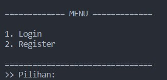
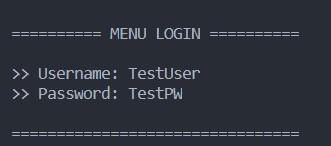
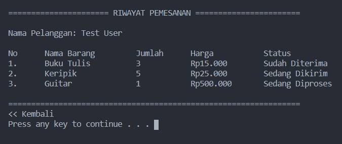
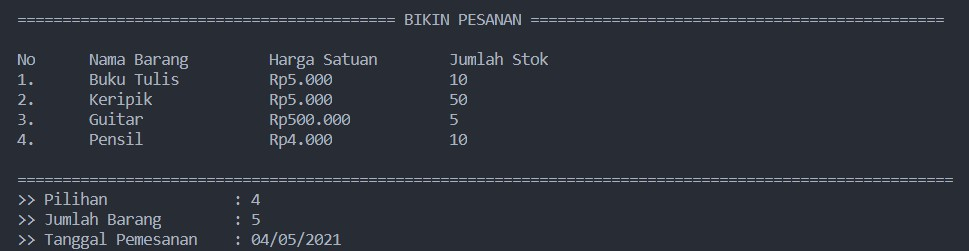
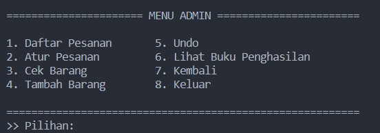
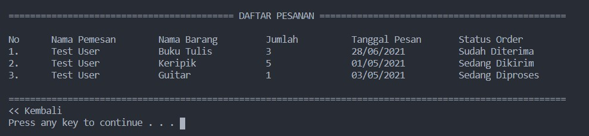
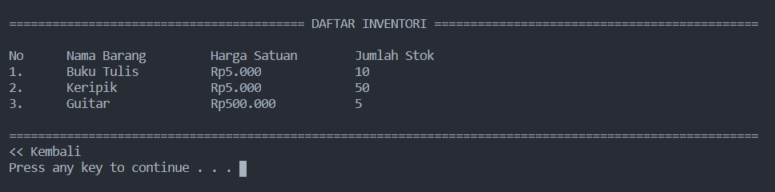
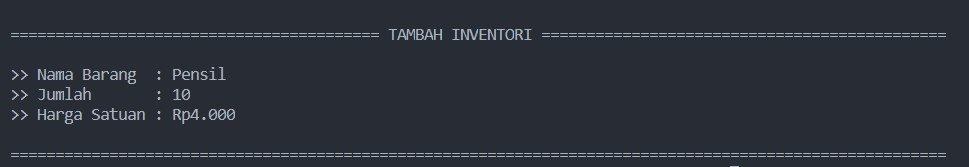

# SISTEM PENGELOLAAN TOKO

Anggota Kelompok:
* Naufal Fahrezi (140810200035)
* Calvin Calfi Montolalu (140810200053)
* Deani Puteri Virdiana (140810200059)
---
## Latar Belakang
Di masa pandemi seperti saat ini tentunya masyarakat akan lebih menjaga kesehatannya dengan cara stay at home atau tetap di rumah. Tentunya masyarakat juga harus keluar untuk membeli beberapa keperluan seperti kebutuhan sandang, pangan, dan papan.  
Maka dari itu untuk mempermudah masyarakat untuk membeli keperluan kami membuat sebuah program pengelolaan toko yang dimana  untuk memudahkan masyarakat untuk membeli kebutuhannya dan membantu mengurangi penyebaran virus COVID-19 yang sedang terjadi saat ini.

## Tujuan dan Manfaat
Program ini dibuat dengan tujuan untuk memudahkan pelayanan dan pengelolaan toko dalam mendata inventory dan pemasukan keuangan toko. Selain,  itu program ini dibuat untuk mengurangi penyebaran virus covid-19. Diharapkan dengan adanya program ini dapat memudahkan pengelolaan toko.

Manfaatnya:
* Memudahkan mendata inventori yang tersedia
* Memudahkan mendata pendapatan dan pengeluaran keuangan
* Memudahkan mendata keluar masuknya barang

## Penjelasan Aplikasi
Aplikasi ini dibangun menggunakan bahasa C/C++ dan dijalankan pada Command Line. Aplikasi ini berfungsi sebagai program yang mengelola toko, baik dari sisi pelanggan maupun dari sisi pengurus toko. Fitur-fitur yang ditawarkan pada aplikasi ini adalah sebagai berikut:
### Untuk Pelanggan
* Membuat, melihat, dan membatalkan pesanan (Menggunakan Linked List)

### Untuk Pengurus Toko
* Menambah (termasuk undo), menghapus barang inventori (Menggunakan Stack)
* Menerima dan Mengatur status pesanan pelanggan (Queue)
* Membaca data pendapatan toko

## Gambar Rancangan Antar Muka
<!--
Buat rancangan antar muka selengkap mungkin sesuai fungsi aplikasinya. rancangan antar muka
diusahakan serapih dan seindah mungkin. tools yang digunakan dalam pembuatan rancangan gambar
dibebaskan sesuai kreatifitas kalian
!-->
* Menu Login/Register  

* Menu Login  

* Menu Pelanggan  

* Riwayat Pesanan  

* Bikin Pesanan  

* Menu Admin/Pengelola Toko  

* Daftar Pesanan  

* Daftar Inventori  

* Tambah Barang  

## Rencana Pengerjaan Projek
<!--
Dalam kondisi pandemi seperti ini, tidak memungkinkan untuk bertemu bertatap muka. Maka dari itu
jelaskan bagaimana kalian bekerja sama, berkoordinasi, pembagian kerja.Tools apa yang kalian gunakan
untuk bekerja bersama sama cth github, google docs, google meet>ibebaskan sesuai kreatifitas kalian
!-->
Mengerjakan project disaat pandemi ini mengharuskan kita memiliki pola pikir yang kreatif, saat pandemi ini semakin banyak software yang dapat digunakan untuk berkomunikasi dan mengerjakan secara berkelompok. Berikut ini adalah software dan aplikasi yang kami gunakan untuk kerja kelompok:
* Google Docs
* Line
* Discord
* Visual Studio Code (Live Share)
* Github

Kami juga melakukan pembagian pekerjaan di setiap masing-masing anggota kelompok. Pembagian tugas sebagai berikut:

    Fahrezi:
    - Merancang algoritma List
    - Merancang alur user

    Calvin:
    - Merancang algoritma Queue
    - Merancang algoritma database

    Deani:
    - Merancang algoritma Stack
    - Merancang UI CLI

## Lisensi

MIT License 2021
